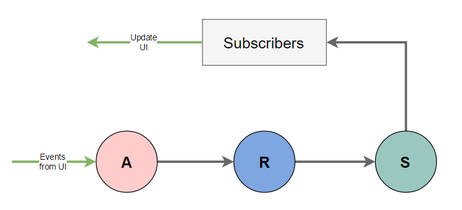
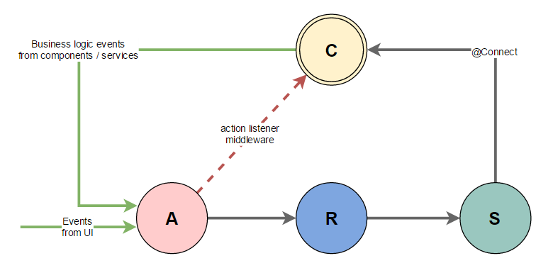

## Motivations

Side effects are notoriously hard to deal with in Redux. Solutions like `redux-thunk` and `redux-saga` offer a way to handle these scenarios, but a better domain-specific separation of concerns can be achieved.

Inspired by the very basic and general principles of domain driven design, `redux-ddd` aims to keep the simplicity of `redux-thunk` and the ability to deal with complex scenarios like `redux-saga`, enabling a modular and domain-specific separation of concerns.

## Design

The basic Redux flow can be summarized by the following diagram:

Everything is synchronous. Actions are generated from UI events. The state is updated by the root reducer. Subscribers react to state changes updating the UI.

Introducing React, the UI is organized in components. The components (via UI events) generate actions, and the state is bound to the React components states (via `connect`) and the UI gets updated after the reduction. That is still the plain-old synchronous Redux flow.

Generalizing the concept of components and borrowing some principles from domain driven design, we can think at a plethora of components that handle different parts of the application specific business logic organized by domain. For example UI components, but also a service that handle a WebSocket channel that encapsulates remote controls actions, a component that represent a scheduled set of actions, ect.

In this sense, we can generalize the diagram in this way:

The `@Connect` should be sufficient in order to maintain purity, but the `actionListenerMiddleware` can be very convenient for simple-enough side-effected scenarios.

## Implementation Details

Using an analogy with `react-redux`, the `@Connect` decorator just wraps the `connectComponent` that is the analogous of the `connect` in `react-redux`. The `mapStateToProps` is passed to the `@Connect`, but then there is no `mapDispatchToProps`: the `dispatch` function is passed to the components that can invoke it in case of component-specific events (e.g., WebSocket message, timers, etc.).

After the `@Connect` the component will have automagically the properties defined in the `mapStateToProps` bound the Redux state.

The `onAction` interceptor/listener can be used to implement asynchronous actions with the simplicity of `redux-thunk`, but separating where the side-effects resides in a domain/component specific way.
